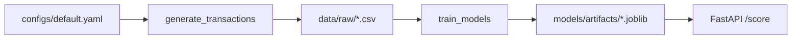

# Architecture

## Components

1. **Data layer** — `nlr_fraud.synthetic_data` produces labeled transactions for development. Production systems swap in warehouse extracts or streaming feature stores while preserving the same column contract used by preprocessing.
2. **Feature + training layer** — `nlr_fraud.preprocess` builds a sklearn `ColumnTransformer` (impute + scale). `nlr_fraud.train` fits stacked pipelines for baseline (logistic) and advanced (histogram gradient boosting) models and writes joblib artifacts plus JSON metrics.
3. **Serving layer** — `api/main.py` (FastAPI) loads the estimator from `NLR_MODEL_PATH` and scores single transactions. `api/flask_app.py` offers the same contract for WSGI stacks.
4. **Automation** — GitHub Actions runs static analysis and tests. Docker packages the API with dependencies.

## Data flow (high level)

## Extension points

- Plug real datasets into `scripts/train.py --input-csv` once schemas align.
- Expand `nlr_fraud.features` and update `NUMERIC_COLS` / preprocessing to cover engineered columns.
- Add model registry (MLflow, W&B) between training and deployment for traceability.
